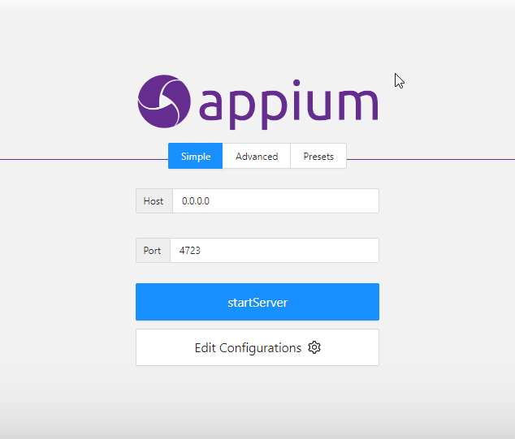
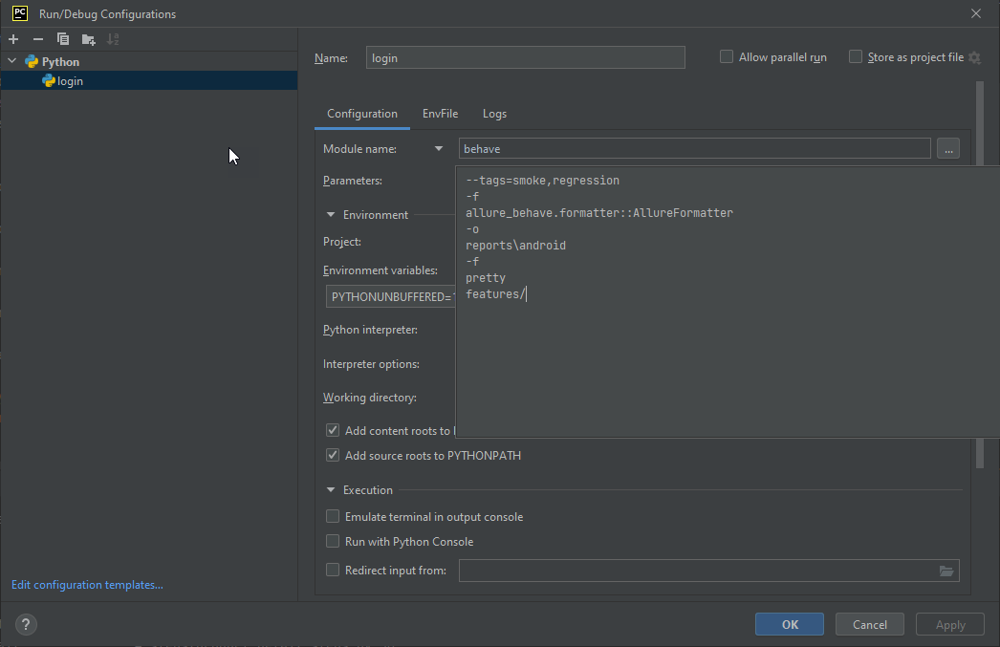
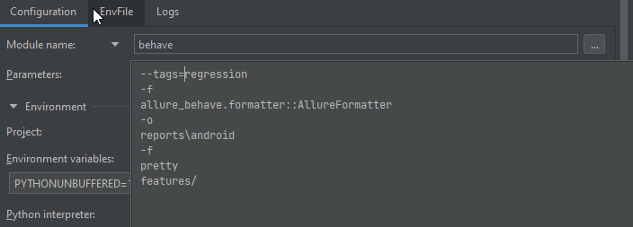
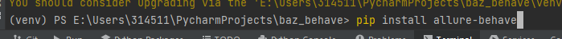
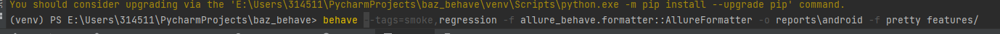

# Proyecto de Appium

Este proyecto contiene la automatización de casos de prueba de varios módulos como son el: login, detalle del articulo, agregar un producto al carrito, filtrar los productos de menor a mayor y realizar una compra de varios productos.

Para eso es necesario considerar la instalación de las siguientes herramientas de software.

* Python3
* Appium server
* Appium inspector
* IDE Pycharm community considerando la instalación de paquetes.
    * Appium-Python-client
    * Pytest
    * Flake8
    * Allure

## Estructura: Carpetas del Proyecto 
````
APPIUM/
├── APP
├── Behave/
│     ├── features/
│            ├── add.product.feature
│            ├── checkout.feature
│            ├── login.feature
│            ├── price.filter.feature
│            ├── product.detail.feature
│     ├── reports/
│            ├── android/
│               ├── history
│     ├── screens/
│            ├── add_product_screen.py
│            ├── checkout_screen.py
│            ├── log_in_screen.py
│            ├── price_filter_screen.py
│            ├── product_detail_screen.py
│     ├── steps/
│            ├── add_product_steps.py
│            ├── checkout_steps.py
│            ├── log_in_steps.py
│            ├── price_filter_steps.py
│            ├── product_detail_steps.py
│     ├── utils/
│           ├── dictionaries/
│               ├── add_product_texts.py
│               ├── checkout_texts.py
│               ├── log_in_texts.py
│               ├── price_filter_texts.py
│               ├── product_detail_texts.py
│               ├── swipe_properties_texts.py
│           ├── common_actions.py
│     ├── .env
│     ├── environment.py
├── venv/
├── README.md
└── requirements.txt
````


## Python3
Entrar a la página oficial https://www.python.org/ y descargar de acuerdo al tipo de sistema operativo con el que se va a trabajar.  

## Appium server
Ingresar a la página oficial https://appium.io/downloads.html seleccionar Appium Desktop Apps mismo que direccionará a github para que descargue el ejecutable que corresponda a su sistema operativo.
Una vez instalado dejar los parametros por default Host y Port y oprimir el botón starServer como el que se muestra en la siguiente pantalla:
   
  

## Appium inspector
Para instalar appium inspector es necesario ingresar a la siguiente url https://github.com/appium/appium-inspector/releases mima que direcciona al repositorio que tiene los ejecutables de acuerdo a cada tipo de sistema operativo.   
Una vez instaldo confirmar que se tenga el mismo host y port que en appium server y agregar en el campo path lo siguiente `/wd/hub`  
  
Agregar el capabilitie de acuerdo a las caracteriticas de dipositivo agrego imagen de refrencia y el json de ejemplo:  
  
```bash
{
        "platformName": "Android",
        "appium:platformVersion": "13",
        "appium:deviceName": "b2q",
        "appium:automationName": "UiAutomator2",
        "appium:app": "e:\\Users\\88433\\Downloads\\appPrueba.apk",
        "appium:appPackage": "com.saucelabs.mydemoapp.rn",
        "appium:appActivity": ".MainActivity"

    }
```
Una vez generado las capabilities
* Guardar el capabilitie
* Iniciar la sesión


## IDE Pycharm Community
Ingresar a la página oficial https://www.jetbrains.com/es-es/pycharm/ y descargar el
ejecutable Community. Recuerde que durante la instalación se deben ambientar las variables de entorno.
El mismos ejecutable presenta una pantalla que permite la configuración de las variables de entorno. 

Una vez que se tenga el IDE, instalar los siguientes paquetes con el uso de la terminal.  
Nota: es importante antes instalar nodeJS para ejecutar los comandos con el prefijo npm. 


### Importar proyecto dentro del IDE
* Oprimir el menu File
* De la lista desplegada oprimir el botón Open
* Buscar el proyecto y oprimir la opción abrir


### Configuración del proyecto antes de correr el set de pruebas

Considerar los siguientes requerimientos [requirements.txt](requirements.txt)

Para instalar las dependencias utilizar el siguiente comando
  
 ```bash
pip install -r requirements.txt
``` 

Dentro de la carpeta utils encontrará un archivo .env que serán las credenciales para poder realizar un login en la app de prueba, las credenciales se las proporcionará negocio.
```bash
STANDARD_USER=
PASSWORD=
```

## Set de pruebas

Para correr el set de pruebas debe tener la siguiente configuración 

* home test que ejecutaría todos los casos de prueba

dentro del campo parameter colocar lo siguiente
* ```bash
  --tags=smoke, regression
  -k
  -D
  platform=android
  -D
  platform_version=13
  -D
  testing_process=serial
  -D
  driver_location=local
  -D
  device_name=b2q
  -f
  pretty
  features/
  ```  
  Nota: `platform_version` y `device_name` depende del modelo de dipositivo android a utilizar  
  

### Para pruebas de regresion 
* Tener una nueva configuración en este caso se nombró regression
* Agregar el parametro `--tags=`(nombre del tag para identificar la prueba de regresion) como se muestra en la imagen.
*   

### Pruebas de humo
* Tener una nueva configuración en este caso se nombró smoke
* Agregar el parametro `--tags=`(nombre del tag para identificar la prueba de regresion) como se muestra en la imagen.
*   

Cada nuevo tag o etiqueta del tipo de prueba se debe colocar en los features especificamente en la parte superior del escenario(Scenario)  

  
### Reportes Allure  

Para generar reporte desde cero con Allure, se deben seguir los siguientes pasos y comandos:

* Intallar allure en nuestra terminal de pycharm 
```bash
    pip install allure-behave
  ```  
* Agregar el paquete allure-behave  
* Posicionarse hasta la carpeta Behave dentro de la terminal y correr los siguientes comandos
```bash
  behave #para ver si corren todos los features 
  
  behave -f allure_behave.formatter:AllureFormatter -o reports/ features # para generar la carpeta reports y correr las pruebas 
  
  allure serve reports/ #para mostrar el reporte
```  
Ejemplo


**Nota**: Tambien puedes ejecutar las pruebas de la siguiente manera: Primero ingresar a nivel de carpeta Behave con el comando por terminal: cd Behave/
```
    behave                                                                          # Run all tests
    behave --tags=@smoke                                                            # Run smoke tests
    behave --tags=@regression                                                       # Run regression tests
    bbehave -f allure_behave.formatter:AllureFormatter -o <nombre_de_carptea>       # Run all tests and generate files to launch allure report
    allure serve <path>                                                             # Run the allure server
    flake8 '<path>'                                                                 # Run flake8 application (Static testing)
```


