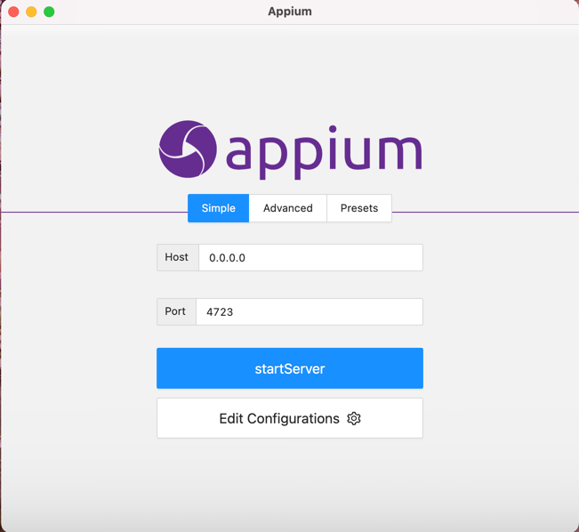
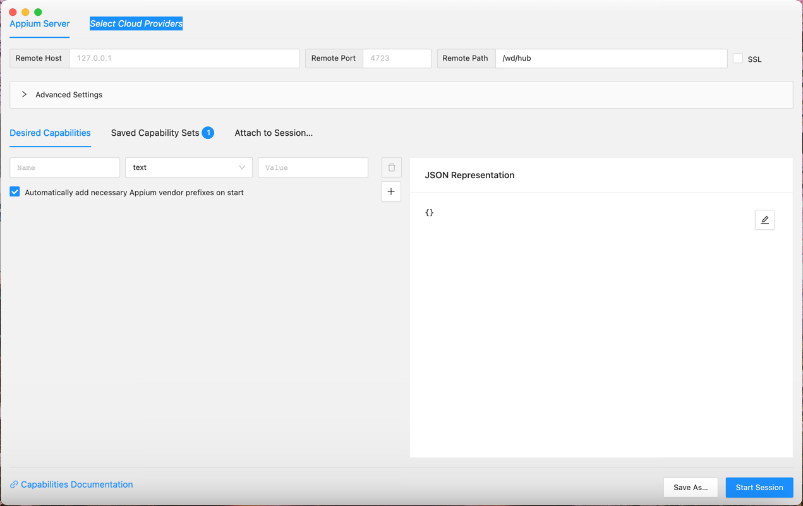
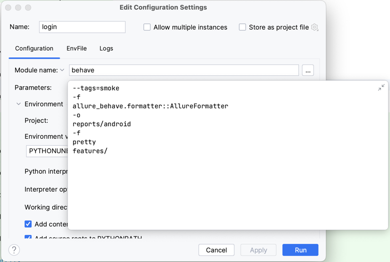

<h1 align="center"> Proyecto APPIUM</h1>
<p align="center"></p>

# Contenido

Este proyecto contiene los ejercicios de automatización de entrega del Capstone Project para el apartado de Appium.
Los casos de prueba que se desarrollan para entregable son:
* Detalle del artículo: Hacer tap sobre cualquier de los artículos disponibles y validar el nombre y precio del arículo seleccionado
* Agregar artículo al carrito de compras: Se agrega artículo al carrito y se valida que la información es correcta
* Tap sobre filtro: Hacer tap sobre el filtro y elegir la opción que ordena los artículos por precio de menor a mayor y se valida que se encuentren ordenados
* Finalizar compra: Agregados múltiples artículos al carrito y se procede a realizar el proceso de pago, envío y se valida que sea correcta


# Herramientas

Para la ejecución de los casos de prueba es necesario la instalación de las herramientas de software que a continuación:

* Python3.11.4
* Appium server
* Appium inspector
* IDE Pycharm community considerando la instalación de paquetes.
    * Appium-Python-client
    * Flake8
    * Allure
    * Behave
    * Selenium

## Python3.11.4 (Versión a Junio 6 de 2023)
Entrar a la página oficial https://www.python.org/ y descargar de acuerdo al tipo de sistema operativo con el que se va a trabajar  

## Appium server
Ingresar a la página oficial https://appium.io/downloads.html seleccionar Appium Desktop Apps mismo que direccionará a github para que descargue el ejecutable que corresponda a su sistema operativo.
Una vez instalado dejar los parametros por default Host y Port y oprimir el botón starServer como el que se muestra en la siguiente pantalla:
   


## Appium inspector
Para instalar appium inspector es necesario ingresar a la siguiente url https://github.com/appium/appium-inspector/releases mima que direcciona al repositorio que tiene los ejecutables de acuerdo a cada tipo de sistema operativo.   
Una vez instaldo confirmar que se tenga el mismo host y port que en appium server y agregar en el campo path lo siguiente `/wd/hub`  
  
Agregar el capabilitie de acuerdo a las caracteriticas de dipositivo agrego imagen de refrencia y el json de ejemplo:  


  
```bash
{
        "platformName": "Android",
        "appium:platformVersion": "13",
        "appium:deviceName": "RFCRA020HLJ",
        "appium:automationName": "UiAutomator2",
        "appium:app": "e:\\Users\\88433\\Downloads\\appPrueba.apk",
        "appium:appPackage": "com.saucelabs.mydemoapp.rn",
        "appium:appActivity": ".MainActivity"

    }
```
Una vez genrado el capabilitie
* Guardar el capabilitie
* Iniciar la sesión

## IDE Pycharm Community
Ingresar a la página oficial https://www.jetbrains.com/es-es/pycharm/ y descargar el
ejecutable Community. Recuerde que durante la instalación se deben ambientar las variables de entorno.
El mismos ejecutable presenta una pantalla que permite la configuración de las variables de entorno. 

Una vez que se tenga el IDE, instalar los siguientes paquetes con el uso de la terminal.  
Nota: es importante antes instalar nodeJS para ejecutar los comandos con el prefijo npm. 


### Importar proyecto dentro del IDE
* Oprimir el menu File
* De la lista desplegada oprimir el botón Open
* Buscar el proyecto y oprimir la opción abrir


### Configuración del proyecto antes de correr el set de pruebas

Considerar los siguientes requerimientos [requirements.txt](requirements.txt)

Para instalar las dependencias utilizar el siguiente comando
  
 ```bash
pip install -r requirements.txt
``` 

## Set de pruebas

Para correr el set de pruebas debe tener la siguiente configuración 

* home test que ejecutaría todos los casos de prueba


* dentro del campo parameter colocar lo siguiente
* ```bash
  --tags=smoke
  -f
  allure_behave.formatter::AllureFormatter
  -o
  reports/android
  -f
  pretty
  features/
  ```  
  
### Reportes Allure  

Para generar reporte desde cero con Allure, se deben seguir los siguientes pasos y comandos:

* Intallar allure en nuestra terminal de pycharm 
```bash
    pip install allure-behave
  ```  
* Agregar el paquete allure-behave 
* Posicionarse hasta la carpeta Behave dentro de la terminal y correr los siguientes comandos
```bash
  behave #para ver si corren todos los features 
  
  behave -f allure_behave.formatter:AllureFormatter -o reports/ features # para generar la carpeta reports y correr las pruebas 
  
  allure serve reports/ #para mostrar el reporte
```  
