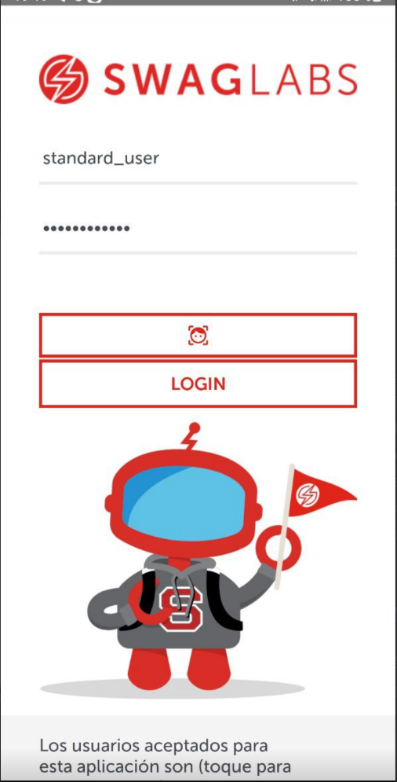
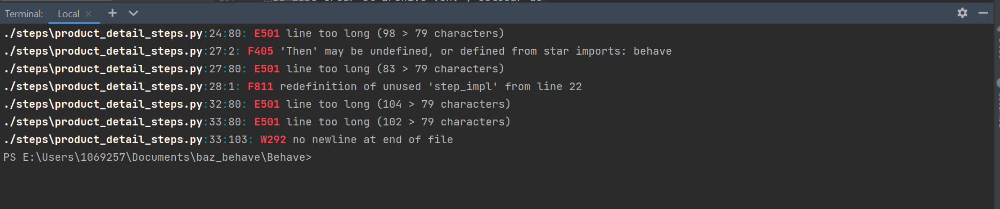

# Carrito de Compra APPIUM

Este proyecto contiene la automatización de casos de pruebas de un carrito de compras con la aplicación
Swag Labs Mobile App

Para eso es necesario considerar la instalación de las siguientes herramientas de software.

* Python3
* Appium server
* Appium inspector
* IDE Pycharm community considerando la instalación de paquetes.
    * Appium-Python-client
    * Pytest
    * Flake8
    * Allure

## Python3
Entrar a la página oficial https://www.python.org/ y descargar de acuerdo al tipo de sistema operativo con el que se va a trabajar.  

## Appium server
Ingresar a la página oficial https://appium.io/downloads.html seleccionar Appium Desktop Apps mismo que direccionará a github para que descargue el ejecutable que corresponda a su sistema operativo.
Una vez instalado dejar los parametros por default Host y Port y oprimir el botón starServer como el que se muestra en la siguiente pantalla:
   


## Appium inspector
Para instalar appium inspector es necesario ingresar a la siguiente url https://github.com/appium/appium-inspector/releases mima que direcciona al repositorio que tiene los ejecutables de acuerdo a cada tipo de sistema operativo.   
Una vez instaldo confirmar que se tenga el mismo host y port que en appium server y agregar en el campo path lo siguiente `/wd/hub`  
  
Agregar el capabilitie de acuerdo a las caracteriticas de dipositivo agrego imagen de refrencia y el json de ejemplo:  


  
```bash
{
       'platformName': 'Android',
        'deviceName': 'R5CW30Z8K9N',
        'app': 'E:\\Users\\1069257\\Documents\\baz_behave\\APP\\sauce_app.apk',
        "appPackage": "com.swaglabsmobileapp",
        "appActivity": ".MainActivity"

    }
 Cabe mencionar   que `platform_version` y `device_name` depende del modelo de dipositivo android a utilizar y en `app` modificar la ruta de la app acorde al path en la que se encuentre el proyecto descargado ya que la ruta que se muestra cambia acorde al dispositivo que se esta usando
```
Una vez genrado el capabilitie
* Guardar el capabilitie
* Iniciar la sesión


## IDE Pycharm Community
Ingresar a la página oficial https://www.jetbrains.com/es-es/pycharm/ y descargar el
ejecutable Community. Recuerde que durante la instalación se deben ambientar las variables de entorno.
El mismos ejecutable presenta una pantalla que permite la configuración de las variables de entorno. 

Una vez que se tenga el IDE, instalar los siguientes paquetes con el uso de la terminal.  
Nota: es importante antes instalar nodeJS para ejecutar los comandos con el prefijo npm. 


### Importar proyecto dentro del IDE
* Oprimir el menu File
* De la lista desplegada oprimir el botón Open
* Buscar el proyecto y oprimir la opción abrir


### Configuración del proyecto antes de correr el set de pruebas

Considerar los siguientes requerimientos [requirements.txt](requirements.txt)

Para instalar las dependencias utilizar el siguiente comando
  
 ```bash
pip install -r requirements.txt
``` 

Dentro de la carpeta utils encontrará un archivo .env que serán las credenciales para poder realizar un login en la app de prueba, las credenciales se las proporcionará negocio.
```bash
STANDARD_USER=
PASSWORD=
```

## Set de pruebas

Para correr el set de pruebas debe tener la siguiente configuración 

* regression que ejecutaría todos los casos de prueba
dentro del campo parameter colocar lo siguiente
* ```bash
  --tags=regression
  -k
  -D
  allure_behave.formatter::AllureFormatter
  -D
  platform_version=13
  -D
  reports/android
  -D
  driver_location=local
  -D
  device_name=b2q
  -f
  pretty
  features/
  ```  

### Para pruebas de regresion 
* Tener una nueva configuración en este caso se nombró regressionTest
* Agregar el parametro `--tags=`(nombre del tag para identificar la prueba de regresion) como se muestra en la imagen.

Cada nuevo tag o etiqueta del tipo de prueba se debe colocar en los features especificamente en la parte superior del escenario(Scenario)
  
### Reportes Allure  

Para generar reporte desde cero con Allure, se deben seguir los siguientes pasos y comandos:

* Intallar allure en nuestra terminal de pycharm 
```bash
    pip install allure-behave
  ```  
* Agregar el paquete allure-behave  
* Posicionarse hasta la carpeta Behave dentro de la terminal y correr los siguientes comandos
```bash
  behave #para ver si corren todos los features 
  
  behave -f allure_behave.formatter:AllureFormatter -o reports/ features # para generar la carpeta reports y correr las pruebas 
  
  allure serve reports/ #para mostrar el reporte
```
### Herramienta de código estático Flake 8
Para instalar Flake8 , abra un shell interactivo y ejecute:
```bash
python<version> -m pip install flake8
 ``` 
Para correr el flake sería con el comando
```bash
python<version> flake8 ./steps  
 ``` 
En el cual al momento de ejecutarlo podemos ver aquellos errores que marca dependiendo del código.

### Nota 
Se debe crear el archivo .env y colocar dentro las variables que se encuentran en el archivo .env-sample ya que por seguridad no se comparte el archivo .env

### Hecho :
Roberto Carlos Chavez Garcia