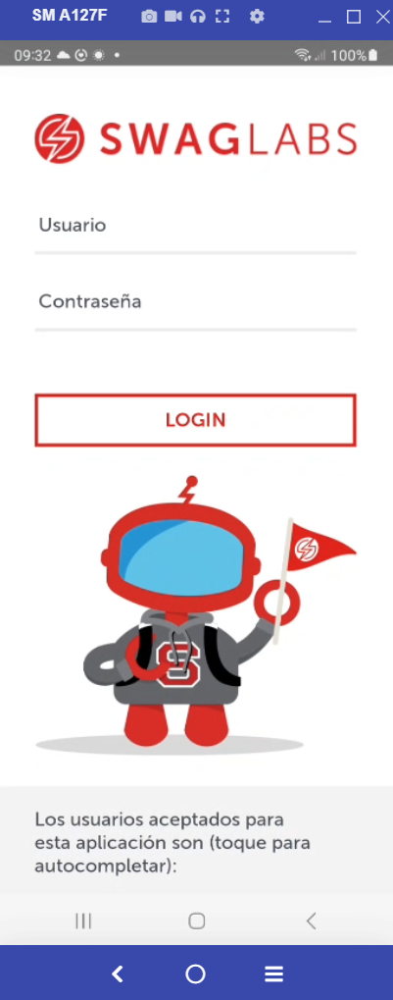
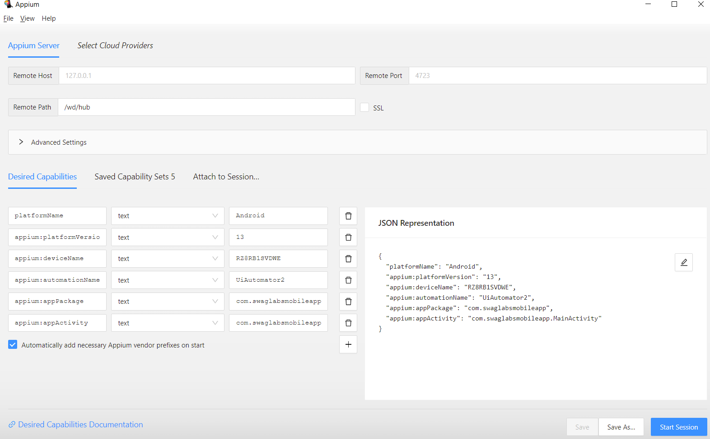
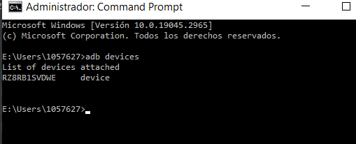
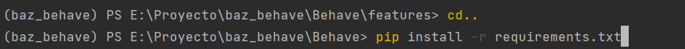
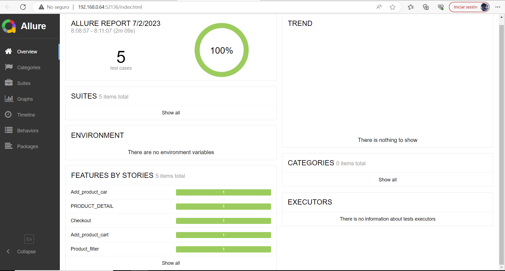
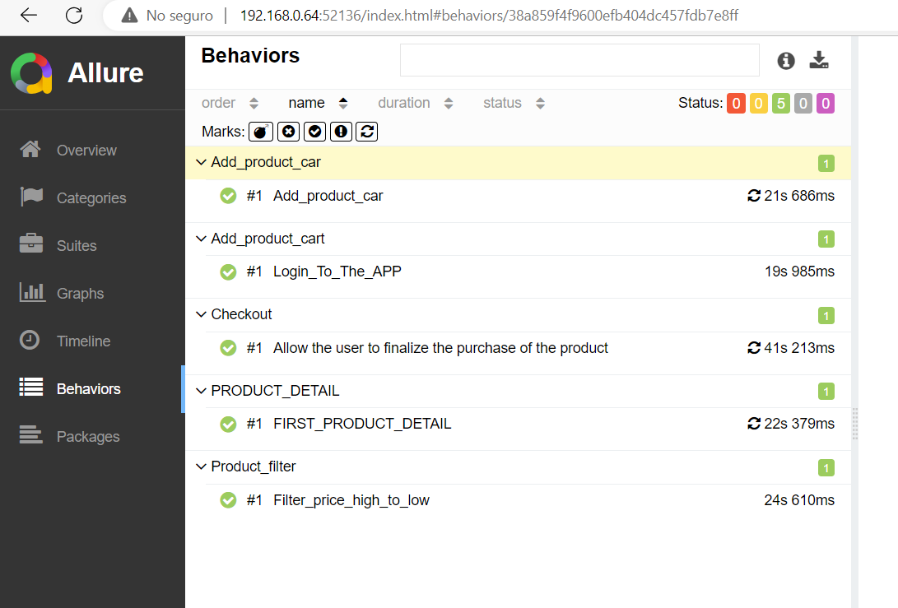
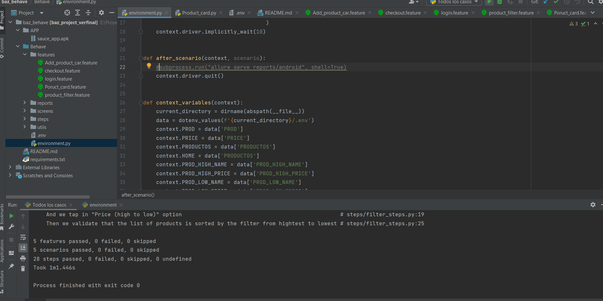

# Proyecto 

Este proyecto contiene la automatización de casos de prueba del modulo de login.
Para eso es necesario considerar la instalación de las siguientes herramientas de software.
 

* Python3
* Appium server
* Appium inspector
* IDE Pycharm community considerando la instalación de paquetes.
    * Appium-Python-client
    * Pytest
    * Flake8
    * Allure

## Python3
Entrar a la página oficial https://www.python.org/ y descargar de acuerdo al tipo de sistema operativo con el que se va a trabajar.  

## Appium server
Ingresar a la página oficial https://appium.io/downloads.html seleccionar Appium Desktop Apps mismo que direccionará a github para que descargue el ejecutable que corresponda a su sistema operativo.
Una vez instalado dejar los parametros por default Host y Port y oprimir el botón starServer como el que se muestra en la siguiente pantalla:
   
  

## Appium inspector
Para instalar appium inspector es necesario ingresar a la siguiente url https://github.com/appium/appium-inspector/releases mima que direcciona al repositorio que tiene los ejecutables de acuerdo a cada tipo de sistema operativo.   
Una vez instaldo confirmar que se tenga el mismo host y port que en appium server y agregar en el campo path lo siguiente `/wd/hub`  
  
Agregar el capabilitie de acuerdo a las caracteriticas de dipositivo agrego imagen de refrencia y el json de ejemplo:  

  
Nota: `platform_version` y `device_name` depende del modelo de dipositivo android a utilizar
  
```bash


Una vez genrado el capabilitie
* Guardar el capabilitie
* Iniciar la sesión
* Nota: `platform_version` y `device_name` depende del modelo de dipositivo android a utilizar
para obtener el 'devices_name' ir la terminal cmd y escribir el comando


y e "Platform_version" es la version instalada de Android  en nuestro dispositivo fisico 


## IDE Pycharm Community
Ingresar a la página oficial https://www.jetbrains.com/es-es/pycharm/ y descargar el
ejecutable Community. Recuerde que durante la instalación se deben ambientar las variables de entorno.
El mismos ejecutable presenta una pantalla que permite la configuración de las variables de entorno. 

### Importar proyecto dentro del IDE
* Oprimir el menu File
* De la lista desplegada oprimir el botón Open
* Buscar el proyecto y oprimir la opción abrir


### Configuración del proyecto antes de correr el set de pruebas

Considerar los siguientes requerimientos [requirements.txt](requirements.txt) Este comando de debe de ejecutar
en la raiz de la carpeta Behave

Para instalar las dependencias utilizar el siguiente comando
  

pip install -r requirements.txt
``` 

Dentro de la carpeta utils encontrará un archivo .env que serán las credenciales para poder realizar un login en la app de prueba, las credenciales se las proporcionará negocio.
```bash
STANDARD_USER=
PASSWORD=
```
 
## Set de pruebas
Para la ejecución de la prueba se debe contar con los siguiente:
        *adb divices
		*IDE: PyCharma
		*Appium Server en ejecución
		*Appium inspector
		*Alguna app para control remoto del dispositivo (Vysor, ApoweMirror, etc)
    
    Para la Ejecución de las pruebas es necesario iniciar los siguiente: 
	1. Descargar en el dispositivo el APK sauce_app.apk
	2. Descargar el proyecto en el equipo a donde se ejecutará 
	3. Ejecutar la herramienta Appium Server GUI (interfaz entre la APP y el proyecto)
	3. Ejecutar PyCharm
    4. Editar el archivo .env como el ejemplo .env_sample de acuerdo a los valores a utilizar, ejemplo:
        STANDARD_USER=""
        PASSWORD=""
Para correr el set de pruebas debe tener la siguiente configuración 

* "Todos los casos"  que ejecutaría todos los casos de prueba 
para este ejemplo cpn el tag #Regresion


dentro del campo parameter colocar lo siguiente
formatter:--tags=Regresion -f allure_behave.formatter::AllureFormatter -o reports/android -f pretty features/

* "Smoke"  que ejecutaría una prueba rapida del flujo completo
"Realizar una compra"
para este ejemplo con el tag #Smoke

dentro del campo parameter colocar lo siguiente
formatter:--tags=Smoke -f allure_behave.formatter::AllureFormatter -o reports/android -f pretty features/

#  Folder Structure
     Baz_Behave/
	├── APP/
	│      ├──sauce_app.apk	
	├── Behave/features
	│      ├── Add_product_car.feature
	│      ├── Checkout.feature
	│      ├── login.feature
	│      ├── Poruct_card.feature
    │      ├── Product_Filter.feature
	├── reports/
	│      ├──android	
	├── screens/
	│      ├── cart_sreens.py
	│      ├── checkout_sreens.py
	│      ├── confirmacion_sreens.py
	│      ├── filter_sreens.py
    │      ├── log_in_sreens.py
    │      ├── productos_sreens.py
    │      ├── summary_sreens.py
	├── steps/
	│      ├── Add_car.py
	│      ├── checkot_steps.py
	│      ├── filter_steps.py
	│      ├── log_in_steps.py
    │      ├── Product_car.py
	├── utils/
	│      ├── dictionaries/
	│      ├── Imagenes
	│      ├── common_actoins.py
	│      ├── .env
	│      ├── environment.py
	│         
	├── venv/
	       ├──── README.md
           └── requirements.txt
   
    

### Reportes Allure  

Generación de reporte:
	El framework cuenta con Allure para la obtención del reporte de la ejecución y se obtiene 
	ejecutando el comando .../Behave/allure serve reports/android, al ejecutar el comando se 
    abrirá una página en explorador 
	determinado con los reportes.
Los reportes se generan de manera automatica al terminar la ejecuacion:


 
 

Ejecucion simpre sin utilizar los reportes de ALLURE comentando la linea 22 
del archivo environment.py para efectos de visualisar reportes planos

 

### Creado  
Roberto Carlos Chavez Garcia
   

